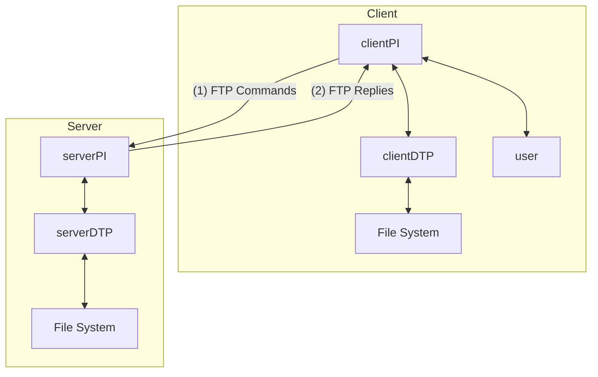
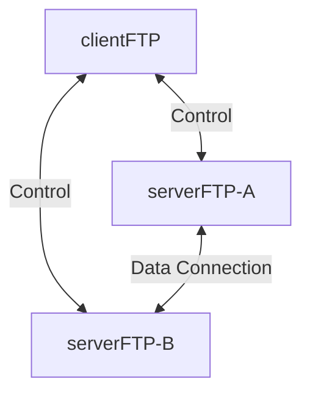
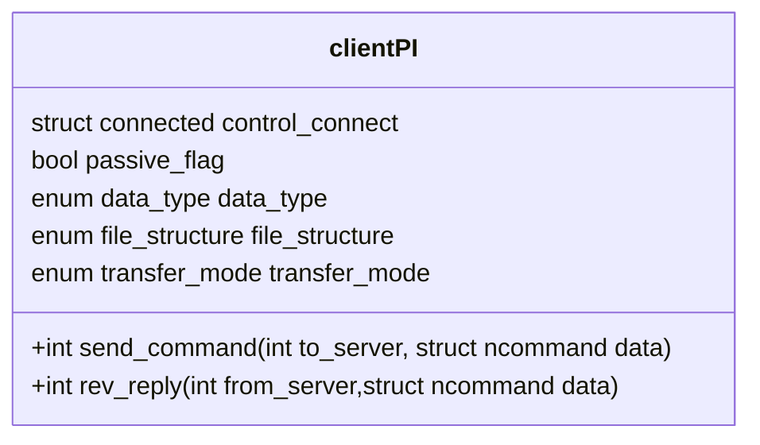
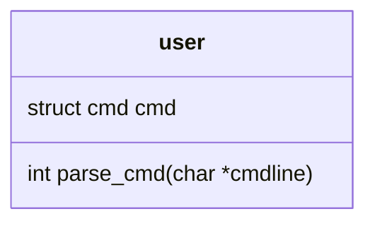
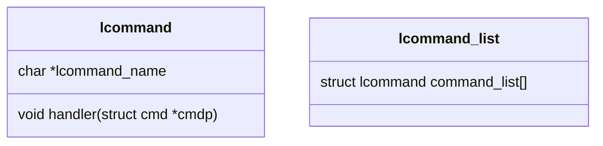
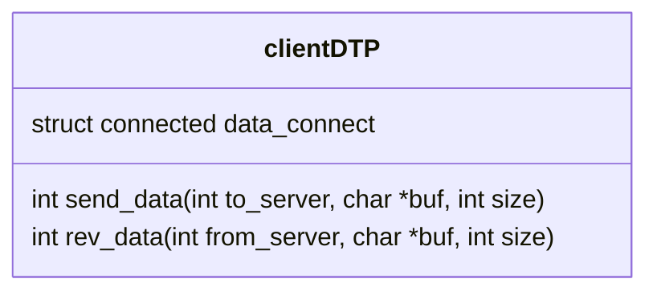

# FTP模型

```mermaid
flowchart TB
clientPI--"(1) FTP Commands"-->serverPI
serverPI--"(2) FTP Replies"-->clientPI
subgraph Client
direction TB
clientPI<-->clientDTP
clientPI<-->user
clientDTP<-->fileSystem1[File System]
end
subgraph Server
serverPI<-->serverDTP
serverDTP<-->fileSystem2[File System]
end
```

```mermaid
flowchart TB
clientFTP<--"Control"-->serverFTP-A
clientFTP<--"Control"-->serverFTP-B
serverFTP-A<--"Data Connection"-->serverFTP-B

```

# FTP客户端

### 需求

1. 客户端会与1或2个服务端通信
2. 客户端DTP可以在数据传输完成后还保持与服务端DTP的连接

### 分析

对于FTP客户端来说，当它和一个服务器通信时需要发送命令和接收回复、发送数据和接收数据

```mermaid
classDiagram

class clientPI{
	struct connected control_connect
	bool passive_flag
	enum data_type data_type
	enum file_structure file_structure
	enum transfer_mode transfer_mode
	+int send_command(int to_server, struct ncommand data)
	+int rev_reply(int from_server,struct ncommand data)
}
```

```mermaid
classDiagram

class user{
	struct cmd cmd
	int parse_cmd(char *cmdline)
}
```

```mermaid
classDiagram
class lcommand{
	char *lcommand_name
	void handler(struct cmd *cmdp)
}
class lcommand_list{
	struct lcommand command_list[]
	
}
```

```mermaid
classDiagram
class clientDTP{
	struct connected data_connect
	int send_data(int to_server, char *buf, int size)
	int rev_data(int from_server, char *buf, int size)
}
```

# FTP服务端

