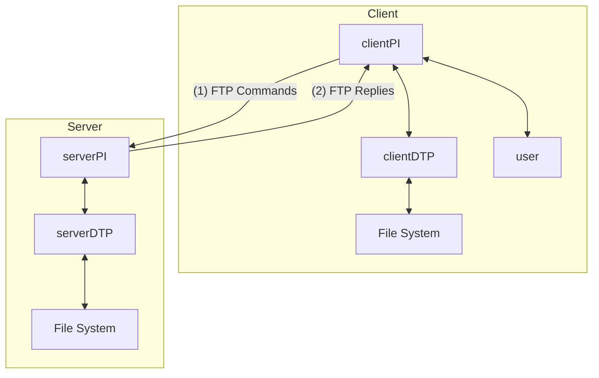
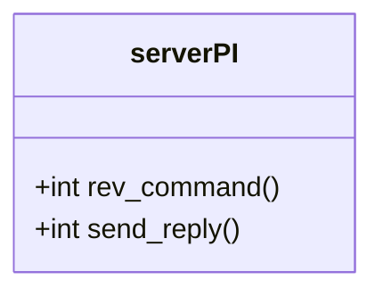

EOR：128

### FTP模型



##### 设计类（对象）

- Client

  ```mermaid
  classDiagram
  
  class clientPI{
  	struct connected
  	bool passive_flag
  	enum data_type data_type
  	enum file_structure file_structure
  	enum transfer_mode transfer_mode
  	+int send_command(int to_server, )
  	+int rev_reply(int from_server,)
  }
  class user{
  	+int get_cmdline()
  	+int parse_cmdline()
  	
  }
  class clientDTP{
  	char file_name[]
  	int server_fd
  }
  class command{
  	char 
  }
  class reply{
  	
  }
  clientPI o-- clientDTP
  clientPI o-- reply
  clientPI o-- command
  
  
  ```

  - 1

  - clientDTP

    与clientPI交互、传数据并存储数据

    ```sequence
    serverDTP-->clientDTP:网络数据类型和网络文件结构的数据
    Note over clientDTP:转换数据类型和文件结构
    clientDTP-->File System:存储数据
    ```

    

    

    


- Server



### FTP命令

##### 访问控制命令

- 用户名（USER）
- 密码（PASS）
- 账户（ACCT）
- 更改工作目录（CWD）
- 更改到副目录（CDUP）
- 结构安装（SMNT）
- 重新初始化（REIN）
- 注销（QUIT）

##### 传输参数命令

所有数据传输参数都有默认值，只有在要更改默认参数值时才需要指定数据传输参数的命令。默认值是最后指定的值，或者 如果未指定值，则标准默认值如下所述。这意味着服务器必须“记住”适⽤的默认值。这些命令可以按任意顺序排列，但它们必须位于  FTP 服务请求之前。

- 数据端口（PORT）

- 被动连接（PASV）

  此命令请求服务器 DTP 在数据端⼝（不是其默认数据端⼝）上“侦听”并等待连接，⽽不是在收到传输命令时启动连接。对此命令的响应包括该服务器正在侦听的主机和端⼝地址。

- 数据表示类型（TYPE）

  默认表示类型是ASCII非打印

- 文件结构（STRU）

- 传输模式（MODE）

##### FTP服务命令

FTP服务命令定义了⽤⼾请求的⽂件传输或⽂件系统功能。 FTP 服务命令的参数通常是路径名。路径名的语法必须符合服务器站点约定 （适⽤标准默认值）以及控制连接的语⾔约定

- 检索（RETR）

- 保存（STOR）

- 唯一保存（STOU）

- 追加（追加保存）（APPE）

- 分配（ALLO）

- 重启（REST）

- 重命名自（RNFR）

- 重命名为（RNTO）

- 中止（ABOR）

  该命令告诉服务器中⽌先前的 FTP 服务命令和任何相关的数据传输。中⽌命令可能需要“特殊操作”（如 FTP 命令 部分中所述），以强制服务器识别。如果前⼀个命令已完成（包括数据传输），则不执⾏任何操作。服务器不能关闭控制连 接，但必须关闭数据连接。

- 删除（DELE）

- 删除目录（RMD）

- 创建目录（MKD）

- 打印工作目录（PWD）

- 列出（LIST）

  此命令导致列表从服务器发送到被动 DTP。如果路径名指定⼀个⽬录或其他⽂件组，则服务器应传输指定⽬录中的⽂件列表。如 果路径名指定⼀个⽂件，那么服务器应该发送该⽂件的当前信息。空参数表⽰⽤⼾当前的⼯作⽬录或默认⽬录。数据通过 ASCII  类型或 EBCDIC 类型的数据连接进⾏传输。

- 名单（NLIST）

- 网络参数（SITE）

- 系统（SYST）

- 状态（STAT）

- 帮助（HELP）

- 空操作（NOOP）

### FTP回复

- 